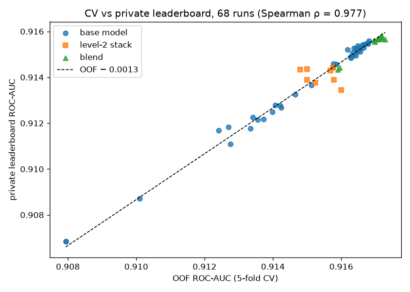
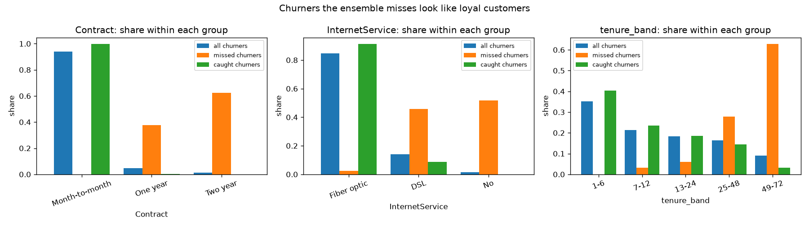

# Predicting customer churn

[](https://github.com/biswajit-nag/Predict-Customer-Churn/actions/workflows/ci.yml)

[](LICENSE)

Binary churn prediction on Kaggle's
[Playground Series S6E3](https://www.kaggle.com/competitions/playground-series-s6e3):
594,194 synthetic telecom customers with 19 features (demographics, subscribed
services, contract and billing), 22.5% of whom churn, scored on **ROC-AUC**.

The project is built around one question: *which differences between models are
real, and which are noise?* It
- runs 72 experiments through a single leakage-aware cross-validation setup;
- logs each one to a git-tracked ledger with enough provenance to rebuild it; and
- tests the whole process against held-out truth, the competition's private
  leaderboard.

**Result:** a pre-registered logistic stack of 11 models scored **0.91582** on the
private leaderboard, and the best single model (tuned LightGBM) **0.91558**. Both
were submitted after the competition closed, so they have no rank. The winning score
was 0.91850; [what the top teams did differently](docs/top_solutions_analysis.md) is
analysed in the docs.

## Highlights

**1. Cross-validation that measurably predicts held-out performance.** Every model
uses the same frozen 5-fold split, and 68 runs were also scored on the private
leaderboard. Out-of-fold (OOF) scores rank the runs almost exactly as the private
leaderboard does (Spearman ρ = 0.977), with a stable offset of 0.0013. The runs that
break the pattern are the level-2 stacks, which is itself a finding (point 3).

<p align="center"></p>

**2. Pre-registration beat picking the OOF winner.** Six blends were fixed before any
leaderboard score was seen. The one with the highest OOF score (0.91729) finished
fifth of the six on the private leaderboard. A pre-registered, moderately regularised
logistic stack on a curated pool (OOF 0.91719) finished first on both public and
private leaderboards. At gains of a few ten-thousandths, the OOF maximum is biased
upwards by selection alone. ([03_Blending](03_Blending.ipynb))

**3. A documented negative result.** Feeding other models' OOF predictions to a
second-level GBDT, with and without pseudo-labels, never beat the base model — in 14
variants. [The write-up](docs/stacking_experiments.md) pins each failure to a
mechanism:
- the stacked features are distributed differently on test rows than on training
  rows;
- the per-fold encoding meant to fix that creates a missingness mismatch trees
  exploit;
- pseudo-labels poison the base rate.

A linear stacker is immune to the first of these, which is why it is the final
layer.

**4. Reproducible from the record.** `02_Experiments` rebuilds the best single model
from its ledger row alone. Its training data hashes to the recorded fingerprint, and
all 594,194 OOF predictions match the logged ones exactly.

## Results

| Model | OOF ROC-AUC | Private LB |
|---|---|---|
| Logistic regression, one-hot features | 0.90794 | 0.90685 |
| Deep tabular net (RealMLP) | 0.91399 | 0.91248 |
| Tabular foundation model (TabPFN, bagged over subsamples) | 0.91425 | 0.91269 |
| Untuned LightGBM, raw features | 0.9150 | — |
| Tuned CatBoost, raw features | 0.91650 | 0.91522 |
| **Tuned LightGBM + 3 engineered features** (best single) | **0.91681** | **0.91558** |
| **Pre-registered logistic stack of 11 models** (best overall) | **0.91719** | **0.91582** |

The first competent model gets almost all of the way: everything after an untuned
LightGBM moved the score by about 0.002. The fold-to-fold standard deviation of a
single model is 0.0009, so the ledger reports per-fold spread for every run, and
comparisons are read against it.

## Approach

- **EDA** ([01_EDA](01_EDA.ipynb)) — the data is clean, with no duplicates even on
  the features alone. Churn is driven by contract type, tenure, internet service and
  payment method. A max-depth probe shows the target is main effects plus low-order
  interactions: CV AUC peaks at depth-3 trees. Adversarial validation (AUC 0.511)
  shows train and test come from the same distribution.
- **Validation** — `StratifiedKFold(5, shuffle=True, random_state=42)` over raw row
  order, committed as [a fold map](experiments/cv_folds_seed42.csv.gz). Before any
  saved OOF vector is reused, its AUC is recomputed and must match the ledger to
  1e-9; this catches row reordering from runs made on Kaggle.
- **Features** ([docs](docs/feature_engineering.md)) — stateless (row-wise)
  features are computed before the split; anything fitted, such as target encoding,
  lives inside the model pipeline and is refitted per fold. Consistent with the
  depth probe, the smallest feature set won: one ratio and two `Contract` crosses.
- **Models** — LightGBM, XGBoost, CatBoost, EBM, random forest, extra trees,
  logistic regression, RealMLP, TabM, TabPFN and TabICL. The GPU models ran on
  Kaggle kernels that clone this repository. Hyperparameters come from Optuna
  studies with early stopping and per-fold pruning, with the final pick made on the
  outer CV.
- **Blending** ([03_Blending](03_Blending.ipynb)) — one model per engine, then
  weighted means, hill climbing, and logistic / LightGBM stacks, all cross-validated
  on the same folds. Equal-weight averaging scored *below* the best single model;
  every learned combiner beat it by +0.0003 to +0.0004 OOF.
- **Error analysis** ([04_Results](04_Results.ipynb)) — the churners every model
  misses look like the most loyal customers: long tenure, long contracts, low bills.

<p align="center"></p>

## Experiment tracking

Every run writes one row to [`experiments/runs.csv`](experiments/runs.csv) and a
folder under `experiments/runs/{run_id}/` with:
- the resolved parameters and per-fold metrics;
- notes on what the run was;
- the uncommitted git diff and a lock-file snapshot;
- OOF and test predictions.

The row records the git commit, a hash of the exact training data, a parameter hash
and the Kaggle public/private scores. Blends are logged as runs too. It is plain CSV
plus files, chosen over MLflow so that it works unchanged inside short-lived Kaggle
kernels and diffs in git. [Design and schema](docs/experiment_tracking.md).

## Repository

```
01_EDA.ipynb             exploratory analysis, depth probe, adversarial validation
02_Experiments.ipynb     the tracking system; rebuilds the best model from its record
03_Blending.ipynb        model diversity, combiners, the pre-registration result
04_Results.ipynb         leaderboard, CV-vs-LB fidelity, error analysis
src/
  data.py                raw CSVs -> one-hot or native-categorical frames (cached)
  features.py            versioned feature sets with a code-hash cache key
  cv.py                  run_cv_experiment / save_experiment
  tracking.py            the ledger: save_run, load_runs, provenance helpers
  tuning.py              Optuna refinement: early stopping, pruning, outer-CV selection
  blending.py            aligned OOF loading, combiners, blends as ledger runs
  stacking.py            level-2 feature builders (the negative result)
  kaggle_io.py           submissions and leaderboard backfill via the Kaggle CLI
scripts/                 fold map, OOF alignment check, blend logging, LB backfill
  archive/               one-off drivers for the level-2 experiments
experiments/             runs.csv, the fold map, per-run records
docs/                    tracking design, feature engineering, stacking post-mortem,
                         top-solution comparison, Kaggle how-tos
tests/                   pytest suite for the invariants above (runs in CI)
```

## Reproduce

Requires [uv](https://docs.astral.sh/uv/) and a Kaggle account that has accepted the
competition rules ([setup](docs/reference/kaggle_setup.md)).

```bash
uv sync --group dev                   # add --extra tfm for TabPFN / TabICL / TabM / RealMLP
python data/fetch_data.py             # competition CSVs -> data/
uv run pytest                         # invariants, including the fold map vs StratifiedKFold
uv run --with jupyterlab jupyter lab  # then run 01 -> 04 from the repository root
```

`01_EDA` and `02_Experiments` need only the competition data. The OOF and test
prediction arrays of the 72 runs (about 1 GB) are not committed, so `03_Blending` and
section 4 of `04_Results` show their saved outputs but need those arrays to re-run.
With the arrays present, `python scripts/check_oof_alignment.py` verifies all of
them against the local data.

## Limitations and next steps

- **The data is synthetic.** Churn here has no time dimension, costs or labelling
  delay, so the project optimises ranking (AUC) only. A deployed model would need
  calibrated probabilities and a decision threshold set from the cost of a retention
  offer against the value of a saved customer.
- **The best model is a blend that includes GPU models.** Four of its eleven members
  (TabPFN, TabICL, TabM, RealMLP) ran on Kaggle GPUs and are not bit-reproducible,
  and no fitted models were kept. Distilling the blend into the single LightGBM,
  which rebuilds exactly, would give a servable model.
- **The remaining gap is in the inputs.** The top teams used the original IBM Telco
  data and features that exploit artefacts of the synthetic generator. Both are
  untested here and are the first things to try
  ([analysis](docs/top_solutions_analysis.md)).
